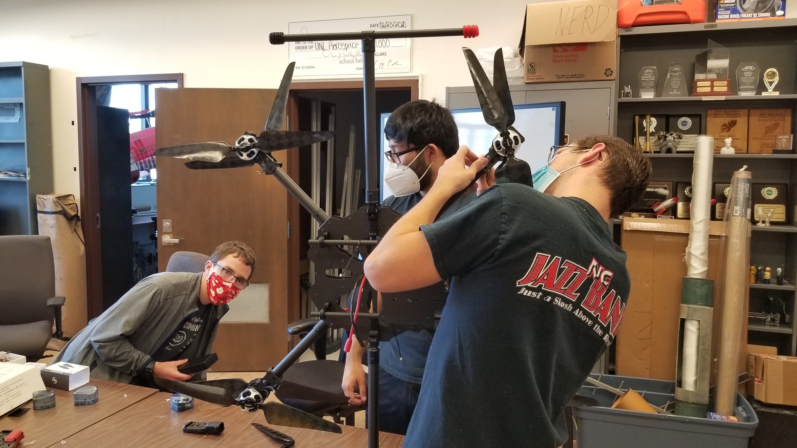
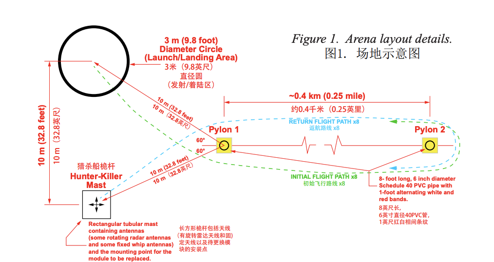

 <h1>UNL Aerospace UAV IARC Team </h1> 

# Who We Are

UNL Aerospace UAV IARC Team is a student-led aerospace design team operating under the [UNL Aerospace Student Organization](http://unlaero.space/). 

We are focused on designing and building an autonomous drone and robotic manipulation system payload capable of accomplishing the AUVSI IARC Mission 9 directives.

***

## Getting Involved

For more information on how to get involved as a member, please visit the [Getting Started](welcome.md) page. For [Sponsorship](sponsors.md), PR and Marketing inquiries, contact us directly at [aerospace-uav@unl.edu](mailto:aerospace-uav@unl.edu?subject=Sponsorship Inquiry). 

For all other questions, please visit the [Contact Us](contact.md) page for more information.

***

## Mission 9 Objective
1. Fly fully autonomous
2. Use ONBOARD computing (no data links except for kill switch and safety pilot override)
3. Avoid obstacles including:
	* Other aerial robots
	* Physical obstacles
4. Conduct the mission successfully (replace the module and return home) under 9 minutes

A detailed arena layout of the course can be seen in the image below.

A link to the AUVSI IARC Mission 9 rules can be found under the [resources](resources.md) page.

***

## What is AUVSI IARC

The Association for Unmanned Vehicle Systems International (AUVSI), the world's largest nonprofit organization dedicated to the advancement of unmanned systems and robotics, represents corporations and professionals from more than 60 countries involved in industry, government and academia. AUVSI members work in the defense, civil and commercial markets. Visit AUVSI at [www.auvsi.org](https://www.auvsi.org/).

The IARC is the longest running collegiate aerial robotics competition in the world, challenging competing teams to develop robotic aerial systems considered impossible for any robots currently owned by government or industry. The IARC proceeds in a series of 'missions', with teams continuing to attempt a particular mission for multiple years until one team succeeds and a new mission is started. Visit the IARC challenge at [www.aerialroboticscompetition.org](http://www.aerialroboticscompetition.org/).

***

## Contact Us
If you are interested in collaborating, or have questions, feel free to reach out to one of us. Contact information for members can be found on the [Contact Page](contact.md) or [People Page](people.md).

You can also reach out to us at [aerospace-uav@unl.edu](mailto:aerospace-uav@unl.edu?subject=Website Questions).

***

***

## License

This website is released using [Creative Commons Attribution](http://creativecommons.org/licenses/by/3.0/) license.
