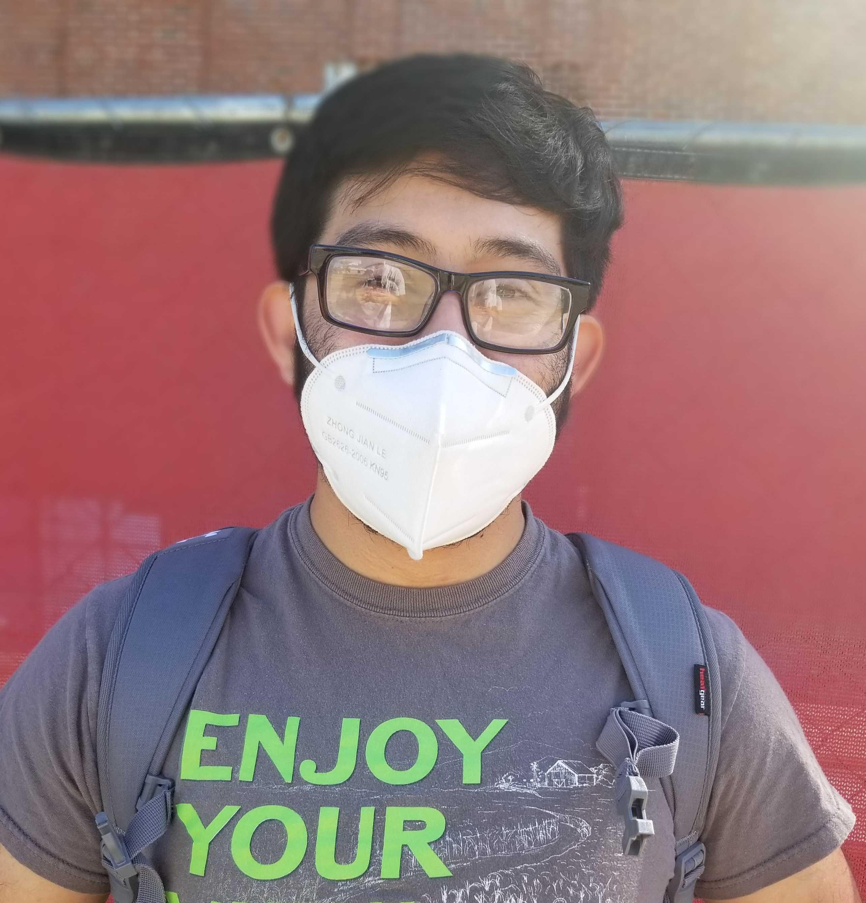
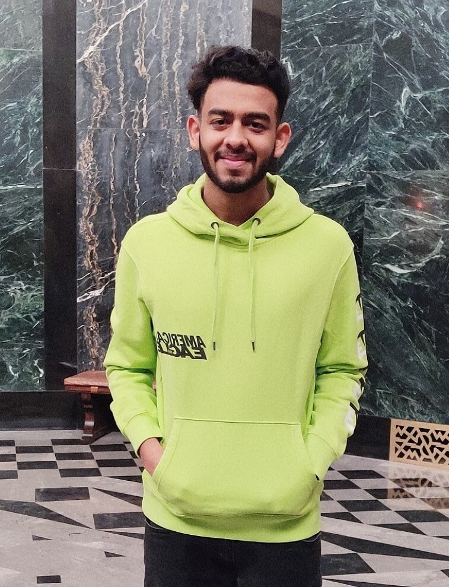

# People

## 2019-2020 Roster

### Admins

#### ** Andrew Hossack - President **

{: style="width:150px"}

UNL Aerospace UAV IARC Team President. I am currently a Junior studying Computer Engineering. Contact by email at [Ahossack2@unl.edu](mailto:ahossack2@unl.edu).

***

### Team Leads

#### ** Grace Becker - Systems Engineering **

{: style="width:150px"}

Grace is a senior getting her bachelor’s in civil engineering. As the Systems Engineer, she bridges the gap between software and hardware; making sure both teams are adhering to criteria and constraints and creating designs and architecture that are realistic to integrate and execute. She also pushes the schedule to make sure design milestones are met at a pace that shows progress. Contact by email at [grace.becker@huskers.unl.edu](mailto:grace.becker@huskers.unl.edu).

***

#### ** Gerson Uriarte - Software Team Lead **

{: style="width:150px"}

Pursuing a Bachelor of Science in Computer Engineering and pre-med status. Work with the software team to develop software that will be on the companion computer, controlling the UAS. Currently doing research at Nimbus Labs on campus. I want to go to med school but am passionate about technology and computers. I enjoy working on software and doing research. Contact by email at [gersongru@huskers.unl.edu](mailto:gersongru@huskers.unl.edu).

#### ** Zury Vasquez - Hardware Team Lead **

{: style="width:150px"}

My name is Zury and in a senior electrical engineering student. I work as a hardware lead on the Aerospace UAV team. I love learning about technology and enjoy exploring. Contact by email at [25zvasquez@gmail.com](mailto:25zvasquez@gmail.com).

#### ** Ryan Karl - Electrical Team Lead **

{: style="width:150px"}

Ryan is a sophomore electrical engineer at the University of Nebraska-Lincoln. He is the electrical lead for the UAV team. The electrical team is responsible for providing power to all systems of the UAV. This team also designs subsystems to fulfill requirements for the competition. Contact by email at [rkarl2@huskers.unl.edu](mailto:rkarl2@huskers.unl.edu).

***

### Members

#### ** Timothy Gibbons - Software Developer **

{: style="width:150px"}

[Website](https://root3287.site)

<marquee>System Adminitration Wizard and Website Maintainer</marquee>

Systems administrator and command-line guru. Tim is responsible for maintenance and upkeep of the Ubuntu Server, as well as managing most things internet-connected.

#### ** Pradhyun Kashyap - Remote Pilot and Support **

{: style="width:150px"}

Unmanned aircraft systems, or drones are no longer toys or hobby, these are now a tool for entry into dozens of lucrative careers. As a Certified Remote Pilot, my job is to manage unmanned aerial vehicle flight operations and make sure to practice all the procedures and policies from Federal Aviation Administration (FAA) to include standard flight and ground operations. Also, my primary tasks include building flight vehicle structure and related components as a support assistance to the hardware team.

#### ** Akshay Bhandari - Hardware Engineer **

{: style="width:150px"}

I am a senior, majoring in Mechanical Engineering at the University of Nebraska-Lincoln. I am an engineer for the hardware team. My job is to design and manufacture the manipulator system, especially the Gripper. I make 3D models of the system using AutoCAD, Solidworks and Autodesk Inventor. I have great passion for Manufacturing. I have had three technical internships, related to manufacturing, over my undergraduate course. I plan to graduate in Fall 2020, and work with my family thereafter.
