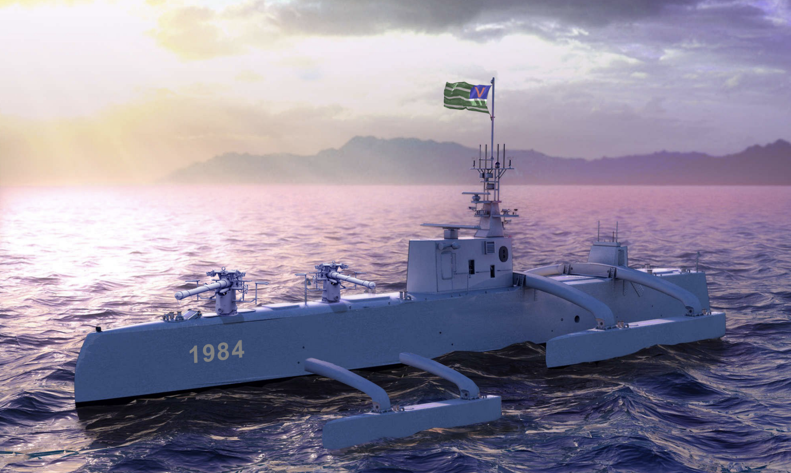

# Mission Rules  

_Information provided in this section is meant to provide a summary of AUVSI IARC Mission 9. Complete and updated details are found on the IARC Website [here](http://www.aerialroboticscompetition.org/rules.php)._   

## Narrative  

You live in a world controlled by artificial intelligence (AI). All super powers are now governed by machines for the benefit of mankind. The AI overlords maintain order in society without emotion, bias, or compassion. Robot armies enforce order and conformity. Humans who express opinions that are contrary to the State are eliminated. The only relatively free people in the world live in human-governed island nations without electronic surveillance-- but many see the control of the super powers encroaching. It is only a matter of time before the AI overlords demand allegiance from these island nations. Swift lethal ocean-going Hunter-Killer vessels able to traverse thousands of kilometers over open seas for months at a time, without a single crew member aboard, patrol the oceans to maintain control of shipping lanes and oceanic commerce.

A group of island nations have secretly banded together to overthrow the AI overlords. A serious flaw has been discovered in the weapons systems used by the AI overlords to maintain control over humanity. A communications module has been developed that will disable all types of weapons systems by causing them to fail to function when commanded. A covert campaign has been instigated to replace as many AI overlord weapons systems with the new communications module as possible over the next 9 months. Unfortunately due to the autonomous nature of the weapons systems, the only way to gain control is to physically replace the communications module and its antenna. Your team has developed a new communications module that is common to all AI overlord weapons platforms. If this module is surreptitiously replaced in any weapons platform, that platform will no longer respond to the AI overlords, but will instead come under the control of the International AI Rejection Coalition (IARC) of which your team is a member.

Your team is located in a small island nation that frequently observes Hunter-Killer vessels operating outside the system of barrier reefs lying 2.5 km (1.6 miles) off the coast. Your team has developed an autonomous sea-skimming aerial robot than can track a Hunter-Killer vessel and rapidly approach it below its radar detection pattern (an altitude of less than 15 m (49 ft)). Once within 100m, the Hunter-Killer’s sensors can not detect the presence of the aerial robot regardless of position due to range-gate limitations. The critical module targeted by your design team is located on the main mast of the Hunter-Killer vessel. It can be removed and replaced with a “hot swappable” replacement module at which time, the Hunter-Killer vessel will come under the control of your team. Your team has prepared a prototype aerial robot to perform this mission on the next Hunter-Killer vessel encountered. If successful, the IARC campaign to replace as many weapons systems communications modules as possible will begin.

## Objective

The autonomous aerial robot will receive as a payload, one replacement communications module. Upon command, your aerial robot will take off and fly at less than an altitude of 15 m (49 ft) to a distance of approximately 3 km (1.9 miles) to apprehend a Hunter-Killer vessel. The aerial robot will then remove the communications module from the Hunter-Killer (dropping it on site) and replace it with the communications module payload that it is carrying. Upon completion of the module swap, the your aerial robot will return to its point of origin and land. Speed is critical. Due to fuel and energy constraints, as well as the expected time that the Hunter-Killer vessel is within range, the entire mission must be completed in 9 minutes.

Your design team’s task is to create an aerial robot that can:

1. Fly fully autonomous
2. Use ONBOARD computing (no data links except for kill switch and safety pilot override)
3. Avoid obstacles including:
	* Other aerial robots
	* Physical obstacles
4. Conduct the mission successfully (replace the module and return home) under 9 minutes
