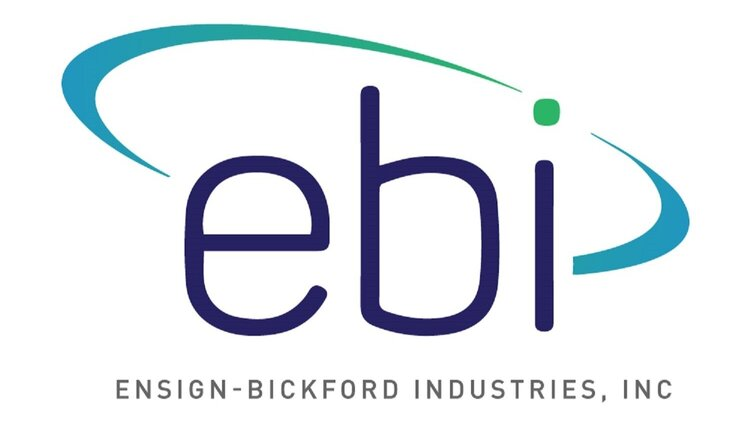
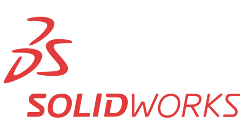

# Our Sponsors

The UNL Aerospace UAV IARC Team would like to give a special thanks to all of the sponsors who allow us to continue to spread and enhance new opportunities.

***

 

[{: style="width:150px"}](http://www.ensign-bickfordind.com/)

ENSIGN-BICKFORD INDUSTRIES (EBI), INC

***

[{: style="width:150px"}](https://www.nespacegrant.org/)

NASA NEBRASKA SPACE GRANT

***

[{: style="width:150px"}](https://engineering.unl.edu/esab-lincoln/)

UNL ENGINEERING STUDENT ADVISORY BOARD

***

[{: style="width:150px"}](https://www.solidworks.com/)

SOLIDWORKS CORP. / DASSAULT SYSTÈMES

***

[{: style="width:150px"}](https://new.siemens.com/)

SIEMENS AG

***

 

## General Information

For questions on sponsorships, please contact us directly at [aerospace-uav@unl.edu](mailto:aerospace-uav@unl.edu?subject=Sponsorship Inquiry).